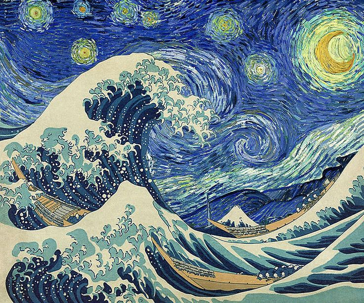
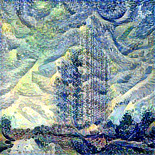

# Neural Style Transfer
In this package, you can transfer a base image to a new image with style by an image you want to refer
##Example:
<table border="0" align="center">
 <tr align="center">
    <td><b style="font-size:30px">Content(Base) Image</b></td>
    <td><b style="font-size:30px">Style Reference Image</b></td>
 </tr>
 <tr align="center">
    <td></td>
    <td></td>
 </tr>
</table>

Here is the result image:
<table border="0" align="center">
  <tr align="center">
    <td><b style="font-size:30px">Generated Image</b></td>
  </tr>
  <tr align="center">
    <td></td>
  </tr>
</table>
Moreover, you can adjust the hyperparameters in <b><i>variables.py</i></b> to adjust that following your favor

## References:
<ul>All my work based on:</ul>
<li><link>https://arxiv.org/pdf/1508.06576.pdf</link></li>
<li><a href="https://d2l.ai/">Dive into Deep Learning</a></li>
<li><a href="https://harishnarayanan.org/writing/artistic-style-transfer/">Convolutional neural networks for artistic style transfer</a